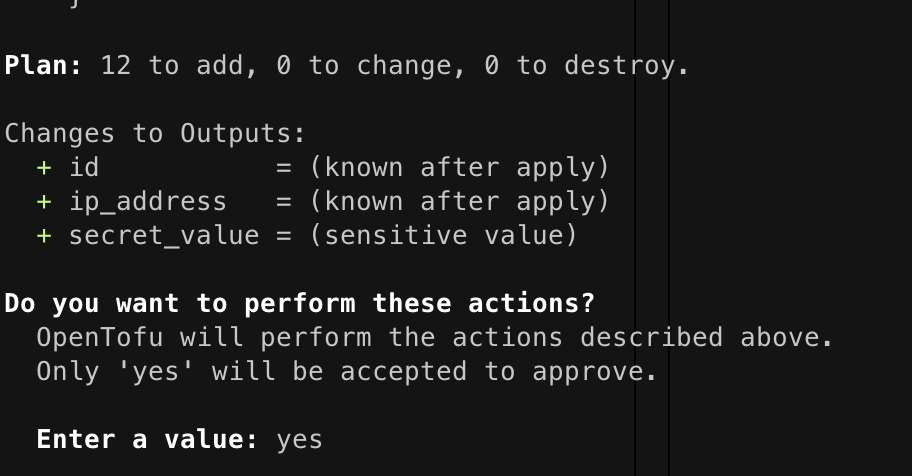
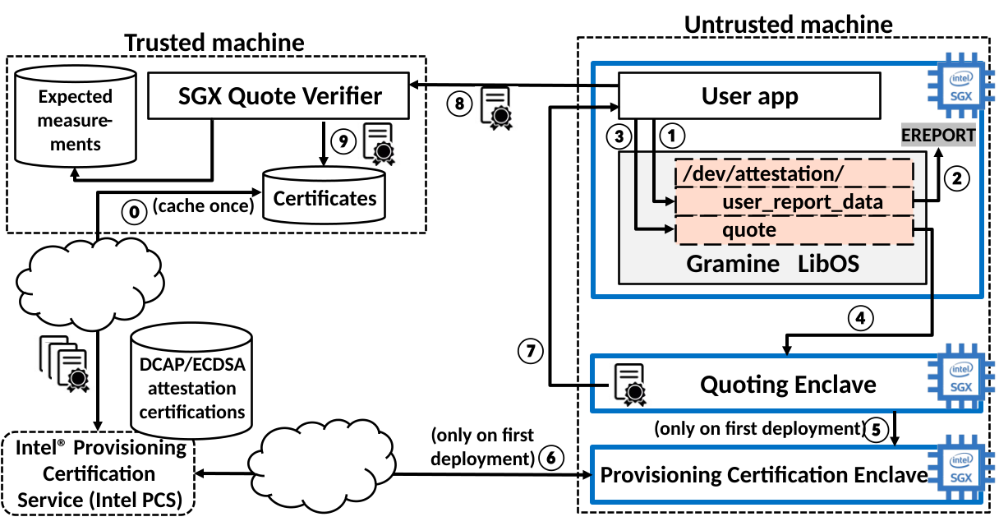

<p align="center">
    
</p>

<p align="center">
<b>One-click Trusted Execution Environment For TLSNotary</b>
    <br>
    ⚠️ not for production ⚠️ 
</p>  

tlsn-tofu was born as a reference for simple and secure infra for tlsnotary to leverage secure enclaves, and to demonstrate how to use their most important (and complex) feature: remote attestation!
<details>
<summary><h2>quick start:</h2></summary>
    
clone this repo; cd into it, then: 
#### 1) install azure cli:
- mac:
```
brew update && brew install azure-cli
```
- linux:
```
curl -sL https://aka.ms/InstallAzureCLIDeb | sudo bash
```

#### 2) login to azure:
 ```az login```
#### 3) install open tofu:

```
chmod +x ./install_tofu.sh && bash ./install_tofu.sh
```

#### 4) install ansible and the terraform extension:
- mac:
```
brew update && brew install ansible && ansible-galaxy collection install cloud.terraform
```
- debian/ubuntu linux:
```
sudo apt-add-repository ppa:ansible/ansible && sudo apt update && sudo apt install ansible && ansible-galaxy collection install cloud.terraform
```

#### 5) configure tofu:
this will create an azure resource group, a vm suitable for SGX to be the verifier, and vm to be the prover, and an SSH key:
```
tofu init && tofu plan && tofu apply
```
if all is well, tofu will ask you to confirm:<br>


<p align="center">
    
</p>

type yes and hit enter

#### 6) run ansible:
this will configure the two vms created above:
```
ansible-playbook -i inventory.yml playbook.yml
```

#### 7) tear it down:

```
tofu destroy
```

#### 8) confetti: 🎉you just ran a tlsnotary verifier inside a TEE!🎉
</details>

### FAQ
-   How does Remote Attestation work?
    -   In this repo we are running the [SGX-TLSNotary-Server](https://github.com/maceip/sgx-tlsn-notary-server) repo inside the TEE, which is a repo using the vanilla TLSNotary Server with a Gramine specific manifest *and* loaded with the [Gramine-RATLS wrapper](https://gramine.readthedocs.io/en/stable/manpages/gramine-ratls.html). Gramine RATLS is a shim that is loaded in the TEE first, and sets up a modified TLS server that implements RATLS.

    -   the steps are as follows:

        1.  the enclavized user application opening the special file ```/dev/attestation/user_report_data``` for write
        2. gramine uses the EREPORT hardware instruction to generate an SGX Report
        3. After the SGX report is generated, the application opens another special file ```/dev/attestation/quote``` for read 
        4. Under the hood, Gramine communicates with the Quoting Enclave to receive the SGX Quote
        5. Quoting Enclave talks to the Provisioning Certification Enclave (PCE)
        6. The PCE uses another Intel service called Intel Provisioning Certification Service (PCS) to obtain the attestation collateral. This collateral comprises attestation certificates and certificate revocation lists for the SGX machine
        7. When the SGX quote arrives, the user compares the certificates embedded in the quote against these cached certificates
    - for more information, consult the [Gramine docs](https://gramine.readthedocs.io/en/stable/attestation.html)    

-   How do I create my own MR_ENCLAVE signature, to see if it matches the signature I get back from SGX Remote Attestation?
    -   Since we are using gramine, this will be a gramine specific answer: You dont even need SGX hardware to create your own MR_ENCLAVE signature. You can clone the SGX-TLSNotary-Server repo, and build it with SGX=0, which tells gramine to emulate SGX. The build ouput will incluide a .sig, and you can check the MR_ENCLAVE value by running gramine-sgx-sigstruct-view.
### TODO
- [x] Azure
- [x] Azure THIM DCAP
- [x] PCCS
- [ ] Remote Attestation Demo
- [ ] TDX
- [ ] SEV-SNP
<h3>Notes</h3>

-  This repo utilizes open tofu to provision TEE capable hardware across various cloud providers. Currently, it only supports a single notary running inside SGX via Gramine on Azure. 

-  The hardware is configured with Ansible, and sets up SGX Remote Attestation (DCAP /w ECDSA), a Provisioning Certificate Caching Service, and a development gramine key.

-  inspect the cloud configuration via:
   - ```tofu show```
-  to see the ansible-host that tofu created, run:
   - ```ansible-playbook -i inventory.yml playbook.yml   --list-hosts```

###### tofu creates a ssh key in ```~/.ssh/${var.resource_group_name_prefix}-sshkey.pem"```. This key is deleted when you use tofu destroy!

__notes from call with chris__
-  explain gramine-ratls and how it's used in this demo
-  how would someone compute an MR_ENCLAVE value on their own (with or without SGX)
-  don't just print the sigstruct hash, loop in the tlsnotary extension and add a plugin that fetches the hash from the tlsnotary github repo (also add the mrenclave of the mainline notary server to the readme.md)
